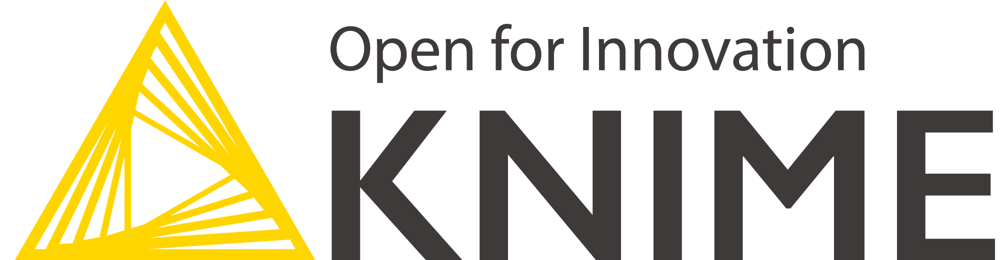

# IEAT | Big Data & AI Analytics Training Program

## Links

- [KNIME](https://www.knime.com/)
- [Ultralytics](https://www.ultralytics.com/)

## Labs

- [LAB1_Classification](lab/LAB1_Classification)
  - Pima Indian Diabetes :
    

- [LAB2_Regression](lab/LAB2_Regression)
  - Body Fat Prediction :
    

- [LAB3_AutoML](lab/LAB3_AutoML)
  - Mall Customer Spending Class Prediction :
    

- [LAB4_Clustering](lab/LAB4_Clustering)
  - Mall Customer Clustering :
    

- [LAB5_ObjectDetection](lab/LAB5_ObjectDetection)
  - Model Training :
    
  - Model evaluation image detection with YOLO (Ultralytics) :
    
  - Image detection with YOLO (Ultralytics) :
    
